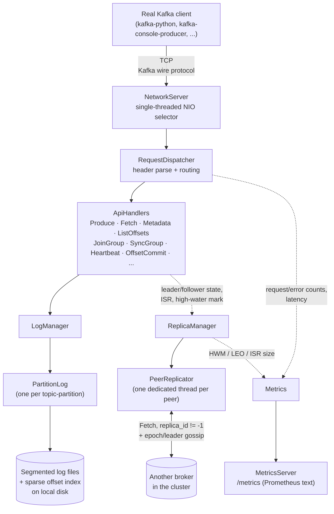

# Architecture

A message broker, written from scratch in Java 21, that speaks the real
**Apache Kafka binary wire protocol** — meaning unmodified, off-the-shelf
Kafka clients (the official `kafka-console-producer`/`kafka-console-consumer`,
Python's `kafka-python`, or any other real Kafka client library) can
produce to and consume from it with zero client-side changes. No Netty, no
Kafka client library, no protocol-adjacent dependency anywhere in the
broker itself — just `java.nio` and hand-rolled binary encoding.

This document is a standalone overview for a reader who has never seen
this codebase. For the full build-out (five milestones, every design
decision, every comprehension gate, every bug found and fixed), see
`PRD.md` (the spec) and `STUDY_GUIDE.md` (the distilled, interview-ready
version of both `PRD.md` and `JOURNAL.md`).

## Why wire compatibility is the hard part

Most "I built Kafka" side projects invent their own JSON-over-TCP
protocol between a custom client and a custom server. That's a
reasonable engineering exercise, but it proves nothing about whether the
hard parts of Kafka's actual design were understood — you control both
ends, so nothing forces you to get the subtle parts right.

Speaking Kafka's *real* wire protocol removes that escape hatch. A real
client:

- frames requests/responses with Kafka's exact length-prefixed binary
  layout, and encodes integers, strings, and arrays with Kafka's exact
  primitive types (including two flavors of variable-length integer);
- negotiates API versions via `ApiVersions` and expects a specific
  fallback behavior if its first guess is wrong;
- sends and expects back real `RecordBatch` v2 structures — a CRC32-C
  checksum over a specific byte range, varint-encoded records inside a
  fixed-width batch header;
- behaves like a real production client: retries, timeouts, idempotence
  defaults, and assumptions about `Metadata` that this project had to
  discover the hard way (see "Real bugs," below).

Getting any of this subtly wrong doesn't throw a compile error — it
produces a client that silently misbehaves, hangs, or misreads a
response. That gap between "looks right" and "is byte-for-byte right" is
exactly what real client testing throughout this project's five
milestones was for.

## Architecture



Four strictly separated layers, each independently replaceable (and, in
practice, independently replaced — M2 swapped the entire storage
implementation without touching the network or protocol layers; M4 added
a whole replication layer beneath `LogManager` without changing what a
client-facing `Produce`/`Fetch` request looks like on the wire):

1. **Network layer** (`NetworkServer`) — one thread, one `java.nio`
   `Selector`, non-blocking sockets. No request is ever handled
   concurrently with another, which is a deliberate simplicity/throughput
   tradeoff (see "Measured numbers," below) rather than an oversight.
2. **Protocol layer** (`RequestDispatcher`, `ProtocolReader`/`Writer`,
   `RecordBatch`) — turns raw bytes into a routed API call and back,
   entirely independent of what any handler actually does with a request.
3. **API handlers** — one class per Kafka API (`Produce`, `Fetch`,
   `Metadata`, `JoinGroup`, ...), each owning only its own request/response
   schema and business logic.
4. **Storage layer** (`LogManager` → `PartitionLog` → real segment files
   on disk, each with a sparse offset index) — durable, crash-recoverable,
   and (since Milestone 4) replicated across a broker cluster by a
   parallel `ReplicaManager`/`PeerReplicator` layer that treats replica
   traffic as a special case of the same `Fetch` API real clients use.

## The five milestones, briefly

| # | What it added |
|---|---|
| 1 | Wire protocol + a real produce/consume round trip against real clients |
| 2 | A durable, segmented log on disk with crash recovery (verified via real `kill -9`) |
| 3 | Multi-partition topics, real long-polling `Fetch`, and the full consumer-group protocol |
| 4 | Multi-broker replication, `acks=all`, and lease-based leader election/failover |
| 5 | Proof: chaos testing, whole-system benchmarks, a Prometheus `/metrics` endpoint, this document |

## Measured numbers (see `BENCHMARKS.md` for full methodology)

- **Storage durability cost:** fsync-per-record vs. batched fsync is a
  **~120-170x** throughput difference on the same machine — the concrete
  answer to "what does the strongest durability guarantee actually cost?"
- **Leader failover:** killing the leader of a real, live partition with
  `kill -9` produces a new elected leader in **~6.8-7.1 seconds** — bounded
  by the configured lease timeout, not a fixed property of the mechanism.
- **Zero acknowledged-message loss under a real leader kill:** a chaos
  test — 3 real OS processes, a real `acks=all` producer, a real
  `SIGKILL` of the leader mid-load — verified **200/200 acknowledged
  offsets** survived, present and correct, across every one of 8 repeated
  runs.
- **Whole-system throughput ceiling:** driving increasing concurrent load
  through the real network protocol against a real broker finds a
  **~57,000-59,000 records/sec** saturation point, at which real stack
  sampling shows the single selector thread spending nearly all of its
  time in raw socket I/O syscalls, not computation — the specific,
  profiled shape of the single-threaded ceiling M1's own design predicted.

## What this project deliberately does not do

No compression, no transactions/exactly-once semantics, no idempotent
producer, no auth (SASL/TLS/ACLs), no admin API or topic auto-creation, no
real quorum-based consensus (leader election is lease-based — a
deliberate, named tradeoff, not an oversight; see `STUDY_GUIDE.md` for
exactly what safety property that gives up and why). The full list, and
the reasoning behind each cut, is in `PRD.md` §2 and `STUDY_GUIDE.md`'s
"honest limitations" section.

## Try it yourself

```bash
bin/demo-cluster.sh start
```

starts a real 3-broker, replication-factor-3 cluster on a clean checkout
and prints exactly what to run next (a real client one-liner, the
`/metrics` endpoint, and how to kill a broker and watch failover).
`bin/demo-cluster.sh stop` tears it down.
